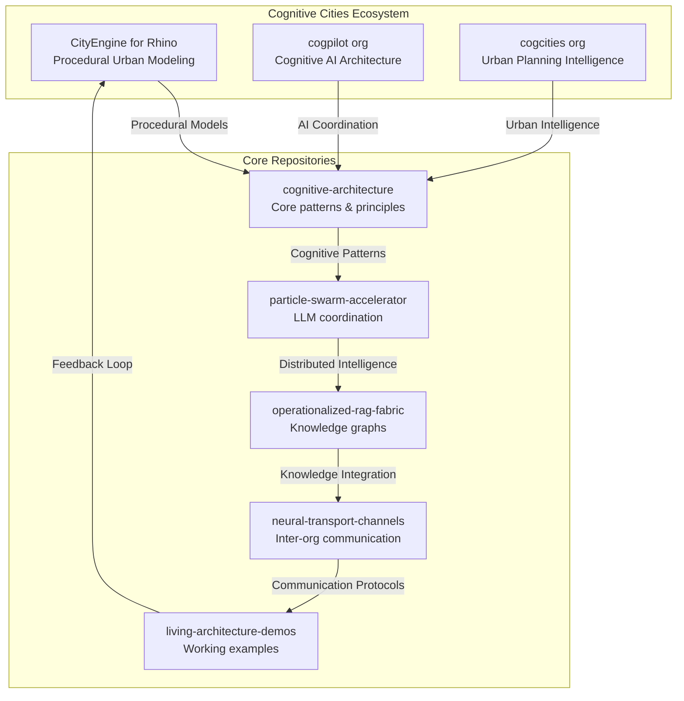
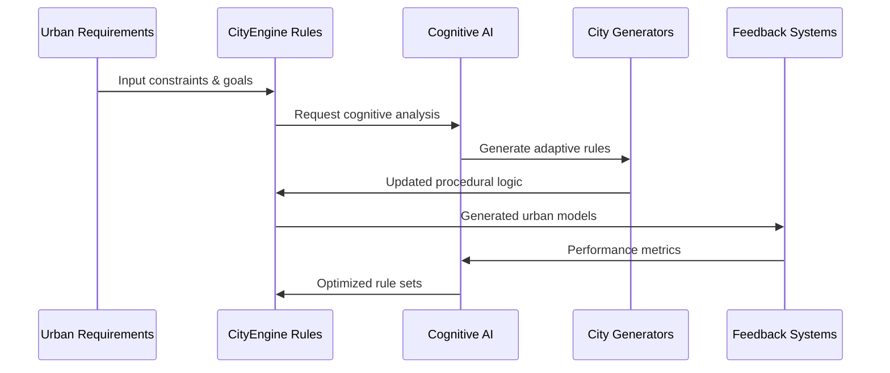

# 🧠 Cognitive Cities Distributed Architecture

## Overview

This CityEngine for Rhino repository has been enhanced to serve as a foundational component in the **Cognitive Cities Distributed Architecture** - a revolutionary approach to urban planning and design that leverages procedural modeling, cognitive AI, and distributed systems to create self-organizing, adaptive urban environments.

## 🏗️ Architecture Vision

## 🎯 Mission Statement

Transform traditional urban modeling from static, predetermined designs to **living, cognitive architectures** that can:

- **Self-organize** based on environmental and social inputs
- **Adapt dynamically** to changing urban conditions  
- **Learn continuously** from urban patterns and outcomes
- **Communicate intelligently** across distributed city systems
- **Evolve architecturally** through cognitive feedback loops

## 🔬 Technical Foundation

### Procedural Cognitive Modeling
CityEngine for Rhino serves as the **procedural engine** that generates urban forms based on cognitive rule sets rather than static parameters. This enables:

- **Dynamic rule evolution** based on AI insights
- **Context-aware generation** responding to real-time data
- **Multi-scale coherence** from building details to city-wide patterns
- **Emergent urban behaviors** through rule interaction

### Distributed Intelligence Network

## 📋 Implementation Roadmap

### Phase 1: Foundation (Current)
- [x] Repository structure enhancement
- [x] Cognitive architecture documentation
- [ ] Integration with existing CityEngine workflows
- [ ] Basic cognitive rule extensions

### Phase 2: Cognitive Integration
- [ ] AI-driven rule parameter optimization
- [ ] Real-time urban data integration
- [ ] Adaptive procedural generation
- [ ] Cross-organizational communication protocols

### Phase 3: Distributed Cognition
- [ ] Multi-city knowledge sharing
- [ ] Emergent pattern recognition
- [ ] Self-improving urban algorithms
- [ ] Cognitive ecology implementation

## 🔗 Organizational Connections

### cogpilot Organization
**Role**: AI Architecture & Cognitive Coordination
- Provides the cognitive intelligence layer
- Manages AI-driven rule evolution
- Coordinates distributed learning systems

### cogcities Organization  
**Role**: Urban Intelligence & Planning
- Supplies urban planning expertise
- Provides real-world constraint integration
- Manages city-scale optimization goals

### Neural Transport Channels
Communication protocols between organizations enable:
- Cross-pollination of urban insights
- Distributed cognitive processing
- Emergent collective intelligence
- Adaptive system evolution

---

> **Note2Self (Copilot)**: This cognitive architecture represents a fundamental shift from traditional CAD/modeling to living, intelligent urban design systems. The key insight is that cities are complex adaptive systems that require cognitive, not just computational, approaches to design and planning. Remember to maintain the balance between procedural power and cognitive adaptability in all future enhancements.

---

*Last updated: 2025-01-09*  
*Updated by: GitHub Copilot*  
*Context: Cognitive Cities Distributed Architecture Integration*