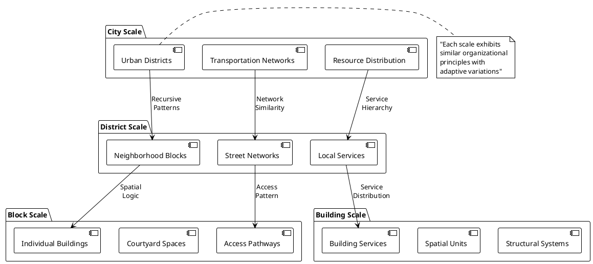
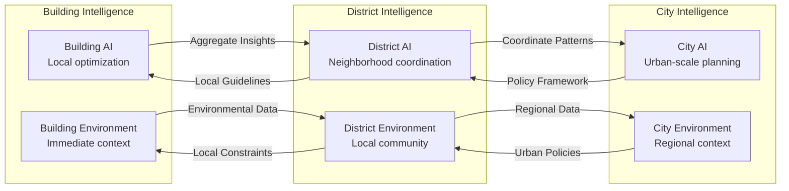
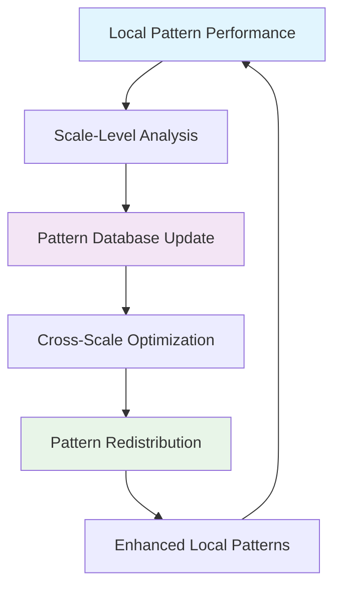

# 🏛️ Fractal Organization Principles

## Overview

The Cognitive Cities Distributed Architecture employs **fractal organization principles** where patterns of intelligence, structure, and behavior repeat at multiple scales - from individual building components to entire urban regions.

## 🔄 Fractal Pattern Implementation



## 🧬 Cognitive Fractal Properties

### Self-Similarity with Variation
- **Pattern Consistency**: Core organizational principles remain consistent across scales
- **Adaptive Variation**: Each scale adapts the pattern to local conditions and requirements
- **Emergent Complexity**: Higher-level behaviors emerge from lower-level pattern interactions

### Scale-Invariant Intelligence


## 🔗 Fractal Communication Protocols

### Vertical Communication (Scale Hierarchy)
- **Bottom-Up Aggregation**: Local patterns inform higher-scale decisions
- **Top-Down Guidance**: Higher-scale policies constrain local variations
- **Bi-directional Optimization**: Continuous negotiation between scales

### Horizontal Communication (Peer Networks)
- **Pattern Sharing**: Similar-scale entities share successful patterns
- **Load Balancing**: Distribute resources and functions across peer networks
- **Collective Learning**: Shared experience improves all participants

## 🎯 Implementation in CityEngine

### Fractal Rule Structure
```cga
// Fractal building generation with scale-aware intelligence
Lot --> 
    case scope.sy > 100: LargeBuilding
    case scope.sy > 50:  MediumBuilding  
    else:                SmallBuilding

LargeBuilding -->
    CognitivePlanning("district_scale")
    split(y) { 
        ~1: DistrictFunction | 
        ~3: ResidentialUnits | 
        ~1: CommunitySpaces 
    }

MediumBuilding -->
    CognitivePlanning("block_scale")
    split(y) { 
        ~1: LocalFunction | 
        ~2: ResidentialUnits 
    }

SmallBuilding -->
    CognitivePlanning("building_scale")
    ResidentialUnits
```

### Cognitive Planning Function
```python
# Pseudo-code for cognitive planning integration
def CognitivePlanning(scale_level):
    """
    Applies fractal intelligence at appropriate scale
    """
    context = gather_environmental_context(scale_level)
    patterns = query_pattern_database(scale_level, context)
    optimization = apply_cognitive_optimization(patterns, context)
    
    return adaptive_rule_parameters(optimization)
```

## 📊 Fractal Metrics and Optimization

### Pattern Coherence Measures
- **Cross-Scale Consistency**: How well patterns maintain coherence across scales
- **Adaptive Efficiency**: How effectively patterns adapt to local conditions
- **Emergent Performance**: How well higher-scale behaviors emerge from lower-scale patterns

### Optimization Feedback Loops


---

> **Note2Self (Copilot)**: The fractal approach is crucial for managing complexity in cognitive cities. Remember that true fractal systems are not just self-similar but self-organizing. Each scale should have the capacity for autonomous decision-making while maintaining coherence with other scales. This is where the cognitive aspect becomes essential - simple geometric fractals won't suffice; we need intelligent fractals that can adapt and evolve.

> **Technical Reminder (Copilot)**: When implementing fractal rules in CityEngine, always consider the computational complexity. Fractal generation can become exponentially expensive. Implement cognitive pruning strategies that know when to stop subdividing based on relevance and resource constraints.

---

*Documentation maintained by: GitHub Copilot*  
*Fractal Intelligence Level: Multi-Scale Adaptive*  
*Next Evolution: Temporal Fractals (4D patterns)*