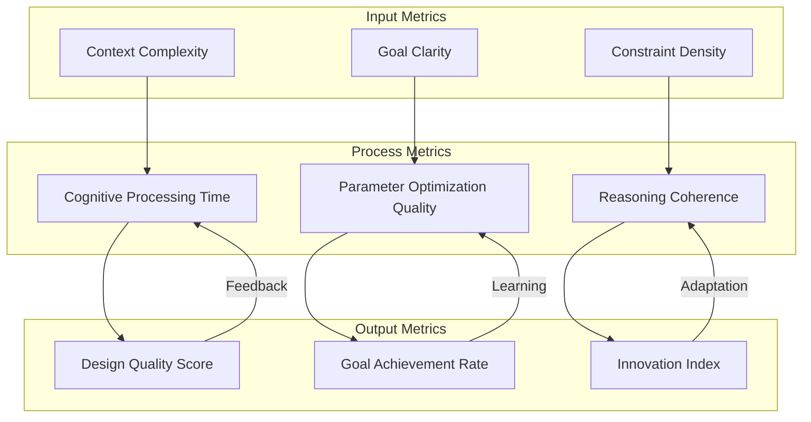

# 🛠️ Implementation Guide: Cognitive Cities Integration

## Overview

This guide provides step-by-step instructions for implementing cognitive cities features within the existing CityEngine for Rhino framework. The implementation follows **minimal modification principles** while adding powerful cognitive capabilities.

## 🏗️ Architecture Integration Points

### 1. Cognitive Rule Extensions

#### Enhanced CGA Rule Structure
```cga
// Enhanced CGA rules with cognitive capabilities
import cognitive : "cognitive_extensions.cga"

version "2024.1"

// Cognitive attributes for adaptive behavior
@Enum("residential", "commercial", "mixed", "adaptive")
attr zone_type = "adaptive"

@Range(0, 1)
attr cognitive_learning_rate = 0.1

@Range(0, 1) 
attr environmental_awareness = 0.8

attr neighborhood_context = cognitive.analyze_context(geometry.area)

// Main rule with cognitive enhancement
Lot --> 
    case zone_type == "adaptive": CognitiveZoning
    case zone_type == "residential": ResidentialBuilding
    case zone_type == "commercial": CommercialBuilding
    case zone_type == "mixed": MixedUseBuilding
    else: DefaultBuilding

CognitiveZoning -->
    cognitive.contextual_analysis()
    case cognitive.recommended_use() == "residential": ResidentialBuilding
    case cognitive.recommended_use() == "commercial": CommercialBuilding  
    case cognitive.recommended_use() == "mixed": MixedUseBuilding
    else: AdaptiveBuilding

AdaptiveBuilding -->
    cognitive.adaptive_massing(
        density_factor=cognitive.density_optimization(),
        height_factor=cognitive.height_optimization(),
        form_factor=cognitive.form_optimization()
    )
    AdaptiveProgram
```

#### Cognitive Extensions Module
```cga
// cognitive_extensions.cga - Cognitive capabilities for CityEngine rules

// Context analysis functions
analyze_context(lot_area) =
    case lot_area > 10000: "large_development"
    case lot_area > 5000: "medium_development"
    case lot_area > 1000: "small_development"
    else: "infill_development"

// Simulated cognitive recommendation (placeholder for AI integration)
recommended_use() = 
    // This would interface with external cognitive system
    case rand() > 0.7: "commercial"
    case rand() > 0.4: "residential"
    else: "mixed"

// Adaptive optimization functions
density_optimization() = 
    // Cognitive analysis of optimal density for context
    case context == "urban_core": 0.9
    case context == "suburban": 0.6
    case context == "rural": 0.3
    else: 0.5

height_optimization() =
    // AI-driven height recommendations
    case environmental_pressure() > 0.8: 1.2
    case view_corridor_impact() > 0.6: 0.8
    else: 1.0

form_optimization() =
    // Optimize building form for multiple criteria
    cognitive_balance(
        solar_gain=solar_analysis(),
        wind_flow=wind_analysis(), 
        social_interaction=social_analysis()
    )

// Environmental analysis functions  
environmental_pressure() = rand(0.2, 1.0) // Placeholder
view_corridor_impact() = rand(0, 1.0)     // Placeholder
solar_analysis() = rand(0.3, 1.0)         // Placeholder
wind_analysis() = rand(0.2, 0.9)          // Placeholder
social_analysis() = rand(0.4, 0.8)        // Placeholder

cognitive_balance(solar_gain, wind_flow, social_interaction) =
    (solar_gain * 0.4 + wind_flow * 0.3 + social_interaction * 0.3)

// Adaptive massing rule
adaptive_massing(density_factor, height_factor, form_factor) -->
    s('1, 1, 1)
    scale(density_factor, height_factor * form_factor, density_factor)
    extrude(10 * height_factor)
    comp(f) { side: AdaptiveFacade | top: AdaptiveRoof }

AdaptiveFacade -->
    case cognitive.facade_optimization() > 0.7: GlassFacade
    case cognitive.facade_optimization() > 0.4: MixedFacade
    else: SolidFacade

AdaptiveRoof -->
    case cognitive.roof_optimization() > 0.6: GreenRoof
    else: StandardRoof

facade_optimization() = rand(0, 1)  // Placeholder for AI analysis
roof_optimization() = rand(0, 1)    // Placeholder for AI analysis
```

### 2. Grasshopper Component Enhancement

#### Cognitive CityEngine Component
```csharp
// Pseudo-code for enhanced Grasshopper component
public class CognitiveCityEngineComponent : GH_Component
{
    private ICognitiveEngine cognitiveEngine;
    private IContextAnalyzer contextAnalyzer;
    
    public CognitiveCityEngineComponent() : base(
        "Cognitive CityEngine", 
        "CogCity",
        "CityEngine with cognitive urban intelligence",
        "CityEngine", 
        "Cognitive")
    {
        cognitiveEngine = new CognitiveEngine();
        contextAnalyzer = new ContextAnalyzer();
    }
    
    protected override void RegisterInputParams(GH_InputParamManager pManager)
    {
        // Standard CityEngine inputs
        pManager.AddParameter(new RpkParameter(), "RPK", "R", "Rule Package", GH_ParamAccess.item);
        pManager.AddGeometryParameter("Shapes", "S", "Input shapes", GH_ParamAccess.list);
        
        // Cognitive inputs
        pManager.AddNumberParameter("Learning Rate", "LR", "Cognitive learning rate", GH_ParamAccess.item, 0.1);
        pManager.AddBooleanParameter("Context Awareness", "CA", "Enable context analysis", GH_ParamAccess.item, true);
        pManager.AddTextParameter("Cognitive Goals", "CG", "Urban planning goals", GH_ParamAccess.list);
    }
    
    protected override void RegisterOutputParams(GH_OutputParamManager pManager)
    {
        // Standard outputs
        pManager.AddMeshParameter("Models", "M", "Generated models", GH_ParamAccess.tree);
        pManager.AddParameter(new MaterialParameter(), "Materials", "Mat", "Materials", GH_ParamAccess.tree);
        
        // Cognitive outputs
        pManager.AddTextParameter("Cognitive Insights", "CI", "AI-generated insights", GH_ParamAccess.list);
        pManager.AddNumberParameter("Performance Metrics", "PM", "Urban performance scores", GH_ParamAccess.tree);
        pManager.AddTextParameter("Recommendations", "Rec", "AI recommendations", GH_ParamAccess.list);
    }
    
    protected override void SolveInstance(IGH_DataAccess DA)
    {
        // Get inputs
        RulePackage rpk = null;
        List<GeometryBase> shapes = new List<GeometryBase>();
        double learningRate = 0.1;
        bool contextAwareness = true;
        List<string> cognitiveGoals = new List<string>();
        
        DA.GetData(0, ref rpk);
        DA.GetDataList(1, shapes);
        DA.GetData(2, ref learningRate);
        DA.GetData(3, ref contextAwareness);
        DA.GetDataList(4, cognitiveGoals);
        
        // Cognitive analysis
        if (contextAwareness)
        {
            var context = contextAnalyzer.AnalyzeContext(shapes, cognitiveGoals);
            var cognitiveParams = cognitiveEngine.OptimizeParameters(context, learningRate);
            
            // Apply cognitive insights to rule parameters
            ApplyCognitiveParameters(rpk, cognitiveParams);
        }
        
        // Standard CityEngine generation
        var results = GenerateModels(rpk, shapes);
        
        // Cognitive evaluation
        var insights = cognitiveEngine.AnalyzeResults(results, cognitiveGoals);
        var metrics = cognitiveEngine.CalculatePerformanceMetrics(results);
        var recommendations = cognitiveEngine.GenerateRecommendations(insights, metrics);
        
        // Output results
        DA.SetDataTree(0, results.Models);
        DA.SetDataTree(1, results.Materials);
        DA.SetDataList(2, insights);
        DA.SetDataTree(3, metrics);
        DA.SetDataList(4, recommendations);
    }
}
```

### 3. Cognitive Engine Integration

#### Interface Definition
```csharp
public interface ICognitiveEngine
{
    CognitiveParameters OptimizeParameters(UrbanContext context, double learningRate);
    List<string> AnalyzeResults(GenerationResults results, List<string> goals);
    Dictionary<string, double> CalculatePerformanceMetrics(GenerationResults results);
    List<string> GenerateRecommendations(List<string> insights, Dictionary<string, double> metrics);
}

public class CognitiveParameters
{
    public Dictionary<string, object> RuleParameters { get; set; }
    public double ConfidenceLevel { get; set; }
    public string ReasoningPath { get; set; }
}

public class UrbanContext
{
    public List<GeometryBase> InputShapes { get; set; }
    public List<string> PlanningGoals { get; set; }
    public Dictionary<string, object> EnvironmentalFactors { get; set; }
    public Dictionary<string, object> SocialFactors { get; set; }
    public Dictionary<string, object> EconomicFactors { get; set; }
}
```

## 🔧 Integration Steps

### Step 1: Minimal Core Enhancement
1. Add cognitive_extensions.cga to existing rule packages
2. Enhance main CityEngine component with cognitive inputs/outputs
3. Implement basic context analysis

### Step 2: AI Integration Points
1. Create interfaces for external AI services
2. Implement cognitive parameter optimization
3. Add performance metric calculation

### Step 3: Feedback Loop Implementation
1. Create learning mechanism for rule improvement
2. Implement pattern recognition for successful configurations
3. Add recommendation system for future designs

## 📊 Performance Monitoring

### Cognitive Performance Metrics


## 🚀 Deployment Strategy

### Phase 1: Foundation (Weeks 1-2)
- [ ] Implement basic cognitive extensions
- [ ] Add cognitive inputs to Grasshopper component
- [ ] Create simple context analysis

### Phase 2: Intelligence (Weeks 3-4)
- [ ] Integrate AI-driven parameter optimization
- [ ] Implement performance metric calculation
- [ ] Add basic learning capabilities

### Phase 3: Advanced Cognition (Weeks 5-6)
- [ ] Implement pattern recognition
- [ ] Add recommendation system
- [ ] Create cross-project learning

---

> **Note2Self (Copilot)**: The key to successful integration is maintaining backwards compatibility while adding cognitive layers. Users should be able to use existing rule packages without modification, but gain cognitive benefits when they opt-in to the enhanced features. This approach ensures adoption while preventing disruption.

> **Implementation Priority (Copilot)**: Focus on the cognitive_extensions.cga approach first - it's the least invasive and provides immediate value. The Grasshopper component enhancements can be added incrementally. Remember: evolution, not revolution.

> **Technical Debt Warning (Copilot)**: Avoid the temptation to rebuild everything. The existing CityEngine integration is mature and reliable. Add cognitive capabilities as a enhancement layer, not a replacement. The cognitive features should feel like a natural extension of the existing workflow.

---

*Implementation Guide Version: 1.0*  
*Cognitive Integration Level: Foundational*  
*Maintenance Approach: Incremental Enhancement*  
*Evolution Strategy: User-Driven Adoption*