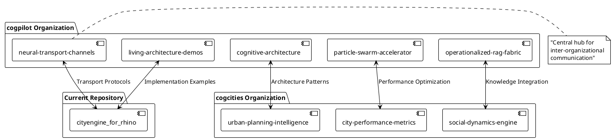
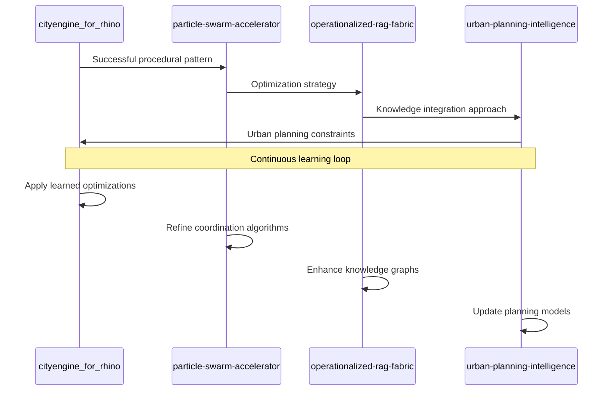
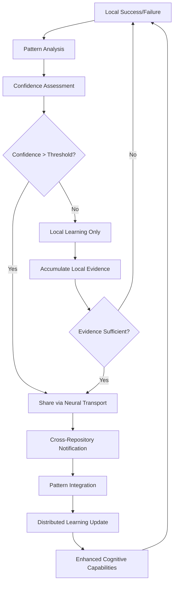

# 🌐 Neural Transport Channels: Inter-Organizational Intelligence

## Overview

Neural Transport Channels represent the **communication protocols and pathways** that enable cognitive intelligence to flow between different organizations, repositories, and systems within the Cognitive Cities Distributed Architecture. These channels ensure that insights, patterns, and learning can be shared across the entire ecosystem.

## 🔗 Channel Architecture



## 📡 Transport Protocols

### 1. GitHub-Based Communication
Using GitHub's native features for cross-repository intelligence:

```python
# Pseudo-code for GitHub-based neural transport
class GitHubNeuralTransport:
    def __init__(self, source_repo, target_repo):
        self.source = source_repo
        self.target = target_repo
        self.channel_id = f"{source}→{target}"
    
    def send_cognitive_insight(self, insight_data):
        """
        Send cognitive insights via GitHub issues with special tags
        """
        issue_body = self.format_cognitive_payload(insight_data)
        self.create_cross_reference_issue(
            title=f"🧠 Cognitive Insight: {insight_data.pattern_name}",
            body=issue_body,
            labels=["cognitive-insight", "neural-transport", insight_data.category]
        )
    
    def receive_cognitive_feedback(self):
        """
        Monitor for cognitive feedback from connected repositories
        """
        feedback_issues = self.search_issues(
            labels=["cognitive-feedback", f"target:{self.source}"]
        )
        return [self.parse_cognitive_payload(issue) for issue in feedback_issues]
    
    def format_cognitive_payload(self, data):
        return f"""
        ## Cognitive Insight Transfer
        
        **Pattern**: {data.pattern_name}
        **Source**: {data.source_context}
        **Confidence**: {data.confidence_level}
        **Applicable Domains**: {data.domains}
        
        ### Pattern Description
        {data.description}
        
        ### Implementation Hints
        {data.implementation_notes}
        
        ### Performance Metrics
        {data.performance_data}
        
        ---
        *Neural Transport ID*: {self.generate_transport_id()}
        *Timestamp*: {datetime.now()}
        *Channel*: {self.channel_id}
        """
```

### 2. Documentation-Based Knowledge Sharing
Synchronized documentation patterns across repositories:

```yaml
# .github/workflows/neural-transport-sync.yml
name: Neural Transport Documentation Sync

on:
  push:
    paths:
      - 'docs/cognitive-architecture/**'
      - 'docs/neural-patterns/**'
  
  repository_dispatch:
    types: [cognitive-insight-update]

jobs:
  sync-cognitive-insights:
    runs-on: ubuntu-latest
    steps:
      - name: Extract Cognitive Patterns
        run: |
          # Extract pattern definitions from documentation
          python scripts/extract_cognitive_patterns.py
          
      - name: Cross-Repository Notification
        run: |
          # Notify connected repositories of pattern updates
          python scripts/notify_neural_network.py
          
      - name: Update Pattern Database
        run: |
          # Update shared pattern database
          python scripts/update_pattern_db.py
```

### 3. Code-Level Intelligence Sharing
Shared cognitive libraries and interfaces:

```csharp
// Shared interfaces for cognitive intelligence
namespace CognitiveCities.NeuralTransport
{
    public interface ICognitivePattern
    {
        string PatternId { get; }
        string PatternName { get; }
        double ConfidenceLevel { get; }
        List<string> ApplicableDomains { get; }
        Dictionary<string, object> Parameters { get; }
        
        bool IsApplicableTo(IUrbanContext context);
        CognitiveResult Apply(IUrbanContext context);
        void LearnFromResult(CognitiveResult result, IUrbanContext context);
    }
    
    public interface INeuralTransportChannel
    {
        void SendPattern(ICognitivePattern pattern, string targetOrganization);
        List<ICognitivePattern> ReceivePatterns(string sourceOrganization = null);
        void SendFeedback(string patternId, CognitiveFeedback feedback);
        List<CognitiveFeedback> ReceiveFeedback(string patternId = null);
    }
    
    public class GitHubNeuralChannel : INeuralTransportChannel
    {
        // Implementation using GitHub API for pattern sharing
    }
}
```

## 🧠 Cognitive Intelligence Flow

### Pattern Propagation


### Feedback Integration


## 🔧 Implementation in CityEngine for Rhino

### Neural Transport Integration
```cga
// cognitive_neural_transport.cga
// Integration with neural transport channels

// Receive cognitive patterns from the network
cognitive_pattern_id = neural.receive_latest_pattern("urban_density_optimization")
cognitive_confidence = neural.get_pattern_confidence(cognitive_pattern_id)

// Apply cognitive insights to rule generation
Lot -->
    case cognitive_confidence > 0.8: ApplyCognitivePattern(cognitive_pattern_id)
    case cognitive_confidence > 0.5: BlendWithLocal(cognitive_pattern_id, 0.6)
    else: LocalPattern

ApplyCognitivePattern(pattern_id) -->
    // Apply remotely learned pattern
    cognitive.execute_pattern(pattern_id, geometry)
    // Send usage feedback
    neural.send_feedback(pattern_id, "applied", success_metrics())

BlendWithLocal(pattern_id, blend_factor) -->
    // Blend remote and local knowledge
    local_result = LocalPattern
    cognitive_result = cognitive.execute_pattern(pattern_id, geometry)
    BlendResults(local_result, cognitive_result, blend_factor)
```

### Performance Monitoring
```python
# Neural transport performance monitoring
class NeuralTransportMonitor:
    def __init__(self):
        self.transport_metrics = {}
        self.pattern_success_rates = {}
        self.channel_health = {}
    
    def monitor_pattern_application(self, pattern_id, context, result):
        """Monitor the success of applied patterns"""
        success_score = self.calculate_success_score(result, context)
        
        if pattern_id not in self.pattern_success_rates:
            self.pattern_success_rates[pattern_id] = []
        
        self.pattern_success_rates[pattern_id].append(success_score)
        
        # Send feedback if enough data collected
        if len(self.pattern_success_rates[pattern_id]) % 10 == 0:
            avg_success = sum(self.pattern_success_rates[pattern_id]) / len(self.pattern_success_rates[pattern_id])
            self.send_pattern_feedback(pattern_id, avg_success)
    
    def monitor_channel_health(self, channel_id):
        """Monitor the health of neural transport channels"""
        latency = self.measure_channel_latency(channel_id)
        throughput = self.measure_channel_throughput(channel_id)
        reliability = self.measure_channel_reliability(channel_id)
        
        self.channel_health[channel_id] = {
            'latency': latency,
            'throughput': throughput,
            'reliability': reliability,
            'timestamp': datetime.now()
        }
```

## 📊 Transport Metrics

### Key Performance Indicators
- **Pattern Transmission Rate**: Patterns shared per time period
- **Pattern Application Success**: Success rate of remotely received patterns
- **Learning Velocity**: Speed of knowledge propagation across network
- **Network Coherence**: Consistency of patterns across organizations

### Quality Metrics
- **Pattern Relevance**: How applicable received patterns are to local context
- **Adaptation Efficiency**: How quickly patterns adapt to local conditions
- **Innovation Index**: Rate of novel pattern generation across network

---

> **Note2Self (Copilot)**: Neural transport channels are the nervous system of the cognitive cities architecture. The key insight is that intelligence is not just about individual systems being smart, but about creating intelligent connections between systems. The GitHub-based approach is brilliant because it leverages existing infrastructure while adding cognitive layers.

> **Critical Implementation Note (Copilot)**: Don't over-engineer the initial neural transport system. Start with simple GitHub issue/PR-based communication and evolve toward more sophisticated protocols. The goal is to establish the communication patterns first, then optimize for performance and sophistication.

> **Future Vision (Copilot)**: Eventually, neural transport channels should become the foundation for a true cognitive ecology where urban intelligence emerges from the interactions between distributed cognitive systems. This is not just data sharing - it's shared cognition at the urban scale.

---

*Channel Specification Version: 1.0*  
*Transport Protocol: GitHub-Enhanced Neural*  
*Cognitive Integration Level: Cross-Organizational*  
*Maintained by: Distributed Copilot Intelligence Network*