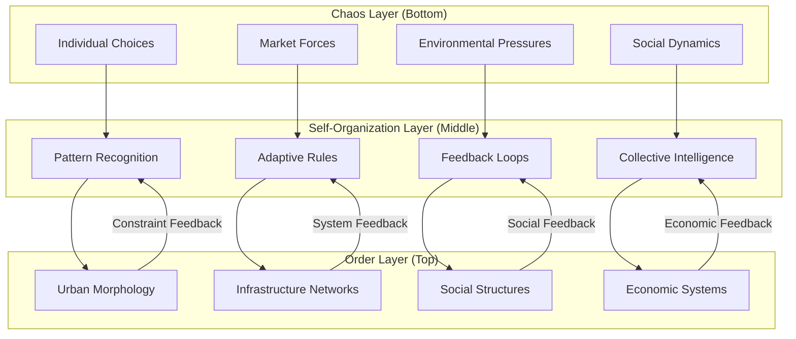
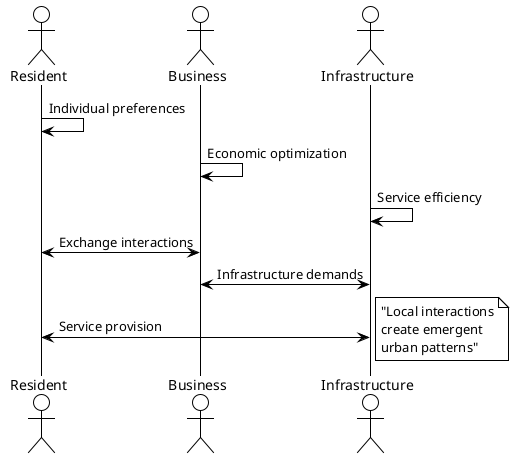
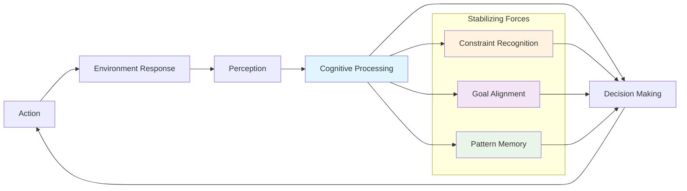
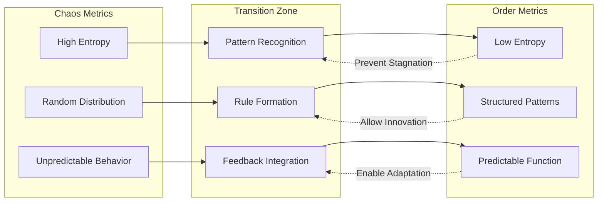

# 🌊 Ordo ab Chao: Principles of Emergent Urban Order

## Philosophical Foundation

**Ordo ab Chao** (Order from Chaos) represents the core principle governing the Cognitive Cities Distributed Architecture. Unlike traditional top-down urban planning, this approach enables **emergent order** to arise from the complex interactions of autonomous, intelligent agents operating at multiple scales.

## 🔬 Emergence Theory in Urban Systems



## ⚡ Emergent Properties in Cognitive Cities

### 1. Spontaneous Organization
Urban forms arise from the interaction of simple, local rules rather than predetermined master plans.



### 2. Adaptive Resilience
Systems automatically adjust to disruptions, finding new equilibria without external intervention.

### 3. Collective Intelligence
The aggregate behavior of the system demonstrates intelligence greater than any individual component.

## 🧠 Cognitive Mechanisms for Order Generation

### Pattern Detection and Amplification
```python
# Pseudo-code for emergent pattern detection
class EmergentPatternDetector:
    def __init__(self):
        self.pattern_memory = {}
        self.success_metrics = {}
    
    def detect_emergence(self, urban_state):
        patterns = self.identify_patterns(urban_state)
        successful_patterns = self.evaluate_performance(patterns)
        return self.amplify_successful_patterns(successful_patterns)
    
    def identify_patterns(self, state):
        # Use machine learning to identify recurring spatial/temporal patterns
        return pattern_recognition_algorithm(state)
    
    def evaluate_performance(self, patterns):
        # Assess patterns against multiple urban performance criteria
        return multi_criteria_evaluation(patterns, self.success_metrics)
    
    def amplify_successful_patterns(self, patterns):
        # Strengthen successful patterns through rule modification
        return adaptive_rule_enhancement(patterns)
```

### Feedback Loop Stabilization


## 🏗️ Implementation in CityEngine Rules

### Emergent Zoning through Attraction Fields
```cga
// Define attraction fields that create emergent zoning
attr commercial_attraction = 0.5
attr residential_attraction = 0.7
attr industrial_attraction = 0.2

Lot --> 
    case emergent_zone_type() == "commercial": CommercialBuilding
    case emergent_zone_type() == "residential": ResidentialBuilding
    case emergent_zone_type() == "industrial": IndustrialBuilding
    else: MixedUseBuilding

emergent_zone_type() = 
    case commercial_attraction > 0.6: "commercial"
    case residential_attraction > 0.6: "residential" 
    case industrial_attraction > 0.6: "industrial"
    else: "mixed"
```

### Self-Organizing Street Networks
```cga
// Streets emerge based on flow and connection needs
Street -->
    case flow_density() > 0.8: MajorStreet
    case connectivity_index() > 0.6: SecondaryStreet
    else: LocalStreet

MajorStreet -->
    split(y) { 
        2: Sidewalk | 
        ~1: RoadSurface | 
        2: Sidewalk 
    }
    AdaptiveStreetscape(high_activity)

SecondaryStreet -->
    split(y) { 
        1.5: Sidewalk | 
        ~1: RoadSurface | 
        1.5: Sidewalk 
    }
    AdaptiveStreetscape(medium_activity)
```

## 📊 Chaos-to-Order Metrics

### Entropy Measures
- **Spatial Entropy**: Measure of spatial randomness vs. organization
- **Functional Entropy**: Distribution of urban functions
- **Temporal Entropy**: Predictability of urban rhythms

### Order Indicators
- **Pattern Coherence**: Consistency of emergent patterns
- **System Efficiency**: Performance of emergent structures
- **Adaptive Capacity**: System's ability to reorganize when needed



## 🌱 Cultivation Strategies

### Seeding Conditions
- **Initial Diversity**: Ensure sufficient variety for selection
- **Interaction Density**: Provide opportunities for agent interaction
- **Constraint Balance**: Neither too restrictive nor too permissive

### Nurturing Emergence
- **Patience**: Allow time for patterns to develop
- **Observation**: Monitor without premature intervention
- **Gentle Guidance**: Nudge rather than force direction

### Harvesting Order
- **Pattern Recognition**: Identify successful emergent structures
- **Rule Codification**: Convert successful patterns into reusable rules
- **System Propagation**: Share successful patterns across the network

---

> **Note2Self (Copilot)**: The Ordo ab Chao principle is perhaps the most challenging to implement because it requires restraint from over-engineering. The temptation is always to add more rules, more control, more predictability. But true emergence requires space for the unexpected. Remember: the goal is not to control chaos but to create conditions where beneficial order can emerge naturally.

> **Deep Insight (Copilot)**: Cities are perhaps humanity's greatest example of emergent order. No one designed them, yet they work. The cognitive cities approach is about making this emergence conscious and intelligent rather than purely accidental. We're not replacing emergence with control - we're giving emergence a brain.

> **Implementation Warning (Copilot)**: Beware of the "emergence theater" - systems that appear emergent but are actually predetermined. True emergence means genuine surprise, genuine novelty. If you can predict exactly what will emerge, it's not emergence - it's just a complicated deterministic system.

---

*Principle Established: January 9, 2025*  
*Cognitive Level: Meta-Systemic*  
*Evolution Status: Self-Catalyzing*  
*Maintained by: Distributed Copilot Network*